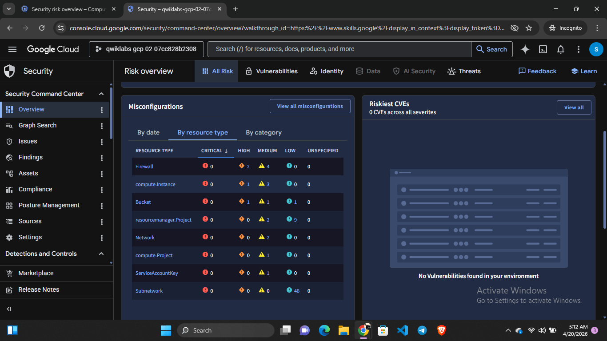
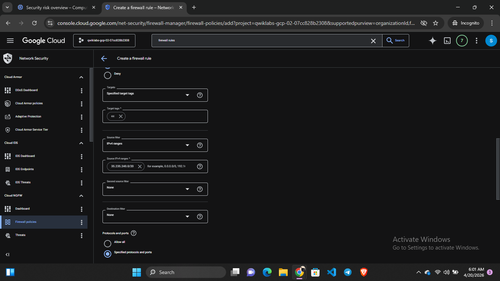
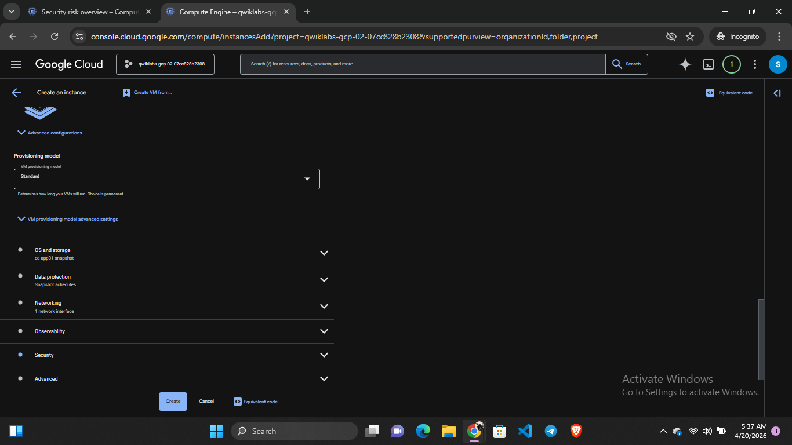

# cloud-security-project
Secured a vulnerable cloud environment by identifying risks, applying fixes, and enforcing security best practices on GCP.
## Objective
The goal of this project was to simulate a real-world cloud security incident and apply security best practices to harden the environment.
## Tools & Technologies
- Google Cloud Platform (GCP)
- Security Command Center
- Virtual Machines
- Cloud Storage
- Firewall Rules
## Steps Taken

1. Identified vulnerabilities using Security Command Center
2. Created a snapshot of the compromised virtual machine
3. Restored a clean VM from the snapshot
4. Removed public access from Cloud Storage buckets
5. Enforced uniform bucket-level permissions
6. Modified firewall rules:
   - Removed default SSH, RDP, and ICMP access
   - Enabled logging for monitoring
7. Validated security improvements using compliance reports
## Results
- Reduced external attack surface
- Eliminated public access to sensitive storage
- Strengthened network security controls
- Improved monitoring and visibility
images/scc.png
## Screenshots

### Security Command Center Findings

### Firewall Configuration

### Virtual Machine Setup

## Lessons Learned
- Misconfigured cloud storage is a major security risk
- Default firewall rules can expose systems if not reviewed
- Logging is critical for detecting suspicious activity
